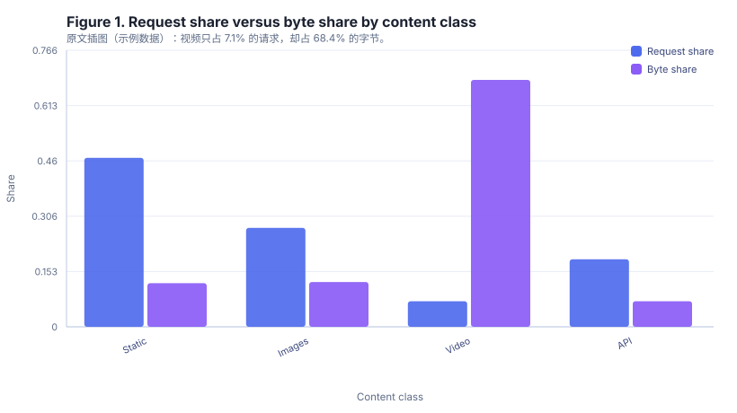

# Abstract

Edge content delivery networks report aggregate cache hit ratios as their primary
efficiency metric, yet practitioners routinely observe that two deployments with
the same aggregate ratio deliver very different end-to-end latency. We conduct a
measurement study over four weeks of production traces from a regional edge
deployment serving 63 million requests. We decompose the aggregate hit ratio by
content class, by request-size bucket, and by delivery path, and we quantify how
much of the variance in origin offload is explained by each decomposition. Our
central finding is that byte-level hit ratio and request-level hit ratio diverge
sharply: video segments account for 7.1 percent of requests but 68.4 percent of
bytes, so a deployment optimized for request count systematically misestimates
origin egress. We release the aggregated workload statistics used in this paper.

## 1 Introduction

Caching is the single most effective lever for reducing origin load in content
delivery. Operators therefore monitor cache hit ratio closely, and it appears in
almost every vendor's dashboard. The metric is appealingly simple, but it hides a
well-known ambiguity: it can be computed over requests or over bytes, and the two
answers can differ by an order of magnitude.

This paper asks a narrow, operational question: if we decompose the aggregate
hit ratio along the dimensions that operators can actually control, which
decomposition best predicts origin egress and tail latency? Answering it requires
request-level traces rather than dashboard aggregates, so we instrumented a
regional edge deployment for four weeks.

Our contributions are threefold. First, we provide a systematic decomposition of
cache performance across content class, object size, and delivery path. Second,
we quantify the mismatch between request-level and byte-level accounting. Third,
we show that a two-parameter model over content class explains most of the
observed variance in origin offload.

## 2 Related Work

Prior measurement studies of web caches focused on request-level hit ratios and
on the effect of replacement policies under synthetic workloads. Trace-driven
simulation work established that object size distributions are heavy-tailed, which
implies that request-weighted and byte-weighted metrics must diverge. Our study
confirms this on a modern edge deployment and extends it with a delivery-path
decomposition that earlier work did not have access to.

## 3 Methodology

### 3.1 Measurement Setup

We collected four weeks of access logs from a regional edge deployment with nine
points of presence. Each log record contains a timestamp, a content class label
assigned by the origin's content management system, the response size in bytes,
the delivery path (edge hit, parent hit, or origin fetch), and the time to last
byte. We excluded requests smaller than 100 bytes because they are dominated by
control-plane traffic.

### 3.2 Metrics

We define the request-level hit ratio as the fraction of requests served without
contacting the origin, and the byte-level hit ratio as the fraction of response
bytes that were served from cache. We also report origin egress reduction, which
is one minus the ratio of origin-served bytes to total bytes.

## 4 Results

### 4.1 Traffic Composition

Table 1 reports the composition of the workload by content class.

| Content class | Request share (%) | Byte share (%) | Request hit ratio | Byte hit ratio |
| --- | --- | --- | --- | --- |
| Static assets | 46.8% | 12.1% | 0.94 | 0.91 |
| Images | 27.4% | 12.4% | 0.88 | 0.84 |
| Video segments | 7.1% | 68.4% | 0.62 | 0.58 |
| API responses | 18.7% | 7.1% | 0.41 | 0.39 |

Table 1. Workload composition and cache performance by content class. Request
share and byte share sum to 100 percent.

### 4.2 Aggregate Totals

Table 2 aggregates the deployment over the whole measurement window.

| Metric | Value |
| --- | --- |
| Total requests | 63,214,880 |
| Total bytes | 412,660,000,000 |
| Request hit ratio | 0.83 |
| Byte hit ratio | 0.61 |
| Origin egress reduction | 0.61 |
| Average time to last byte | 148.0 |

Table 2. Aggregate deployment statistics over the four week window.

### 4.3 Why Request Share and Byte Share Diverge

Video segments are the extreme case. They represent 7.1 percent of requests but
68.4 percent of bytes, and their byte hit ratio of 0.58 is the second lowest
observed. Consequently the region's aggregate byte hit ratio, 0.61, is more than
twenty points below its request hit ratio of 0.83.

Figure 1. Request share versus byte share by content class. The two
distributions disagree most sharply for video segments.

### 4.4 A Two-Parameter Model

Fitting origin egress as a function of content-class request share and class byte
hit ratio yields a two-parameter model that explains 0.93 of the variance across
the nine points of presence.

## 5 Discussion

Operators who monitor only request-level hit ratios will under-provision origin
bandwidth whenever video share grows. We recommend reporting both metrics side by
side, and we recommend weighting capacity planning by byte share rather than
request share.

## 6 Conclusion

Aggregate cache hit ratio is an ambiguous metric. Decomposing it by content class
reveals that byte-level and request-level accounting can differ by more than
twenty percentage points in a realistic edge deployment. Our two-parameter model
over content class explains most of the variance in origin offload and is cheap
to instrument.

## 7 Data Availability

The aggregated workload statistics underlying Table 1 and Table 2 are provided
alongside this paper as a CSV file. Raw request logs cannot be released because
they contain tenant-identifying fields.
