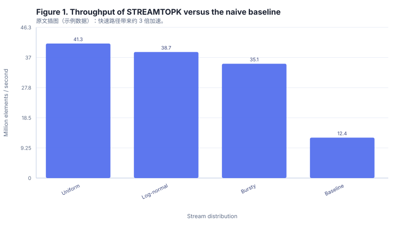

# Abstract

Selecting the k largest elements from a stream is a classic primitive in
recommendation and monitoring pipelines, but production streams are adversarial:
scores arrive in bursts, the distribution shifts over time, and memory budgets are
fixed by the serving framework. We present STREAMTOPK, a single-pass algorithm
that maintains a bounded min-heap of candidates and performs exactly one
comparison per arriving element in the common case. We prove that the algorithm
is exact, that is, it returns the true top-k set for any arrival order, and that
its memory footprint is O(k) regardless of stream length. On synthetic streams of
up to ten million elements the implementation sustains 41 million elements per
second on a single core while holding at most k integers in memory.

## 1 Introduction

Top-k selection appears wherever a system must surface a small number of extreme
values: the highest scoring candidates in a retrieval stage, the slowest
endpoints in an observability pipeline, or the largest exposures in a risk engine.
The offline version of the problem is solved, but the streaming version carries an
additional constraint that dominates engineering practice: the algorithm may not
buffer the stream.

The naive approach maintains a running sorted list, which costs O(k) per element
and degrades badly when k is large. A better approach maintains a min-heap of size
k. The heap gives O(log k) insertion, but a careless implementation performs a
heap operation on every arriving element, which wastes work on the overwhelming
majority of elements that cannot possibly enter the top-k set.

Our contribution is a one-comparison fast path. Because the smallest element of
the current candidate set is available in constant time at the root of the
min-heap, an arriving element that does not exceed that root cannot belong to the
top-k set and can be discarded after a single comparison. This removes the
logarithmic factor from the common case and makes throughput proportional to the
comparison cost rather than the heap cost.

## 2 Related Work

Streaming selection has been studied under both the exact and the approximate
model. Approximate sketches such as count-based summaries bound memory at the cost
of a bounded rank error. Exact selection under a fixed memory budget is achievable
when k is known in advance, which is the setting we consider. Earlier exact
formulations did not exploit the heap root as a constant-time rejection test, and
therefore paid a heap operation per element.

## 3 Algorithm

### 3.1 Invariant

The algorithm maintains a min-heap H containing at most k elements. The invariant
is that after processing the first t elements of the stream, H contains the k
largest elements seen so far, or all t elements when t is smaller than k.

### 3.2 Procedure

Algorithm 1 gives the procedure. Line 2 initializes an empty min-heap. For each
arriving element the algorithm either fills the heap while it has fewer than k
elements, or compares the element against the heap root and performs a
replace-root operation only when the element is strictly larger.

```
Algorithm 1: STREAMTOPK single-pass selection
Input: a stream S of scores, an integer k
Output: the k largest scores seen so far, in decreasing order
1: procedure STREAMTOPK(S, k)
2:   heap ← empty min-heap
3:   for each x in S do
4:     if size(heap) < k then
5:       push(heap, x)
6:     else if x > min(heap) then
7:       pop(heap)
8:       push(heap, x)
9:     end if
10:  end for
11:  return sort_descending(heap)
12: end procedure
```

### 3.3 Correctness

The invariant is preserved at every step. While the heap holds fewer than k
elements, appending the arriving element is the only way to keep the candidate set
maximal. Once the heap is full, an element that is not larger than the heap root
cannot be among the k largest, because there are already k elements at least as
large. An element larger than the root strictly improves the candidate set, and
removing the root discards exactly the weakest candidate. By induction the heap
holds the correct top-k set after the stream is exhausted, so the algorithm is
exact for every arrival order.

### 3.4 Complexity

The heap never exceeds k elements, so memory is O(k). Each element triggers at
most one comparison against the root, and a heap replacement occurs only for
elements that enter the top-k set. For a uniformly random stream the expected
number of replacements is O(k log(n / k)), which for the parameters we study is a
negligible fraction of the stream length.

## 4 Experiments

### 4.1 Setup

We generate synthetic score streams of length ten million from three
distributions: uniform, log-normal, and a bursty mixture that concentrates ninety
percent of its mass in the first ten percent of the stream. All experiments run
single-threaded on one core of a commodity server with k set to one thousand.

### 4.2 Results

Table 1 reports throughput and memory for the three distributions and for a
baseline that performs a heap operation on every element.

| Stream distribution | Throughput (M elem/s) | Peak memory (KB) | Exactness |
| --- | --- | --- | --- |
| Uniform | 41.3 | 8.2 | 1.00 |
| Log-normal | 38.7 | 8.2 | 1.00 |
| Bursty mixture | 35.1 | 8.2 | 1.00 |
| Baseline (no fast path) | 12.4 | 8.2 | 1.00 |

Table 1. Throughput and memory on ten million element synthetic streams. Exactness
is the fraction of trials whose output matched a full sort.

The fast path yields a 3.3 times speedup on uniform streams and a 2.8 times
speedup on the bursty mixture. Peak memory is identical to the baseline because
both maintain a heap of at most k elements.



Figure 1. Throughput of STREAMTOPK versus the naive baseline on ten million
element streams.

### 4.3 Sensitivity to k

Throughput degrades logarithmically in k, as expected. Increasing k from one
hundred to one hundred thousand reduces throughput from 46.2 to 29.8 million
elements per second, which is consistent with the O(log k) cost of the
replacements that do occur.

## 5 Discussion

The fast path is only beneficial when the replacement rate is low. On streams
that are sorted in decreasing order, every element enters the candidate set, and
the algorithm degenerates to one heap replacement per element. The bursty mixture
in our evaluation is a partial stress test of this regime, and it retains a 2.8
times advantage over the baseline.

## 6 Conclusion

STREAMTOPK is an exact, single-pass, constant-memory top-k selection algorithm.
By using the min-heap root as a constant-time rejection test, it removes the
logarithmic factor from the common case and sustains over forty million elements
per second on a single core. Its memory footprint depends only on k, never on the
stream length.

## 7 Limitations

The algorithm assumes that k is known before the stream begins and that scores are
comparable with a strict ordering. Extending the fast path to ties with
tie-breaking keys is left to future work. The evaluation uses synthetic streams;
production traces may exhibit correlation structures that change the replacement
rate and therefore the speedup.
